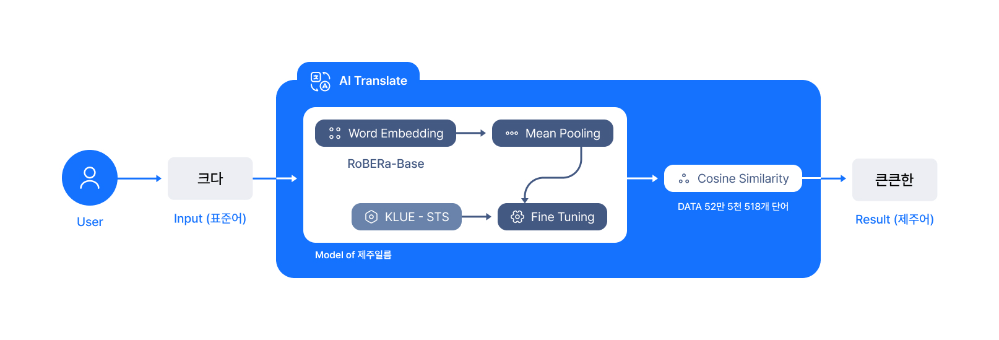

# 🍊제주일름

사라져 가는 제주어를 살리기 위한 프로젝트. 나의 이름 뜻과 생일을 제주어로 바꿔보세요!

9월 21일부터 10월 3일까지 v1.5로 배포 예정입니다.

## 서비스 목표

우리는 제주도의 고유 문화인 제주어가 사람들의 기억에서 잊혀져 가고 있다는 것을 파악했습니다.

<aside>

🔗 유네스코 “제주어, 아주 심각한 위기”
[(기사원문)](https://www.hani.co.kr/arti/society/area/459186.html) 

🔗 사라질 위기…“제주어를 지켜라”
[(기사원문)](https://m.khan.co.kr/local/Jeju/article/202202181452011#c2b)

</aside>

조금이라도 더 많은 사람들이 제주어를 알게 하려면 어떻게 해야할까? 이것이 제주일름의 시작입니다.

## 기능 소개

기능 소개는 구름톤 배포 당시의 기능을 기준으로 작성되었습니다.(제주일름 v1.0)

<aside>
📖 제주일름은 누구나 쉽고 재미있게 즐길 수 있도록 콘텐츠를 제공합니다.

</aside>

### 내 **이름을 제주어로 번역하기(Process)**

- 이름을 입력하고 이름의 의미(한자 뜻, 지어주신 의미)를 문장으로 입력해 주세요.
- 제주어 특징상 동사 또는 형용사 입력시 정확도가 올라가요!
- 작성해주신 의미와 유사한 제주어로 제주이름을 만들어 결과 값을 제공합니다.

### **생일을 제주어로 번역하기(Process)**

- 월과 일을 선택해 주세요.
- 제주일름이 제주도의 4계절을 떠올리며 가장 어울리는 단어들을 준비했어요.

### **이름 카드 제공(Result)**

- 제주어로 번역한 결과를 이름 카드로 제공합니다.
- 이름 카드의 일러스트는 계절에 따라 디자인이 바뀌며 일부 요소는 랜덤하게 제공해 다양한 이미지를 얻을 수 있도록 제작되었습니다.
- 이름 카드를 이미지로 저장해 SNS 또는 메신저로 공유할 수 있습니다.
- 많은 사람들이 제주이름을 만들고 제주어로 소통할 수 있도록 합니다.

## 아키텍처

<aside>
🐳 초기 아키텍처는 구름톤에서 교육받은 EKS를 사용하여 서버를 구축하였습니다.

</aside>

구름톤 당시의 아키텍처

제주일름 서비스는 총 두 가지 서버를 사용합니다.

React를 사용하는 프론트 서버와 제주어로 번역해주는 Ai Service 서버, 총 두 가지 서버를 각 다른 방법으로 배포했습니다. 프론트 서버는 React를 Flask로 빌드하여 Docker 컨테이너 형태로 배포하였으며, Ai Service 서버는 EKS를 통해 서버를 배포하였으며 컨테이너 이미지는 퍼블릭 ECR에 올렸습니다.

<aside>
🛠 구름톤 이후 비용과 효율을 고려해 EKS대신 EC2와 S3 정적 배포로 서버를 구축하였습니다

</aside>

서비스 운영에 최적화한 현재의 아키텍처

EKS는 시간당 1달러로 서비스 트래픽 대비 오버 디벨롭이라 판단하였고, 비용과 효율을 고려해 프론트 서버는 EC2에서 S3 정적배포로 디벨롭하고 Ai Service 서버는 EKS에서 딥러닝용 EC2 서버를 사용하여 디벨롭했습니다.

## AI 모델

<aside>
🤖 제주특별자치도에서 제공하는 방언사전 (https://www.jeju.go.kr/culture/dialect/dictionary.htm) 의 데이터를 사용하였습니다. 총 52만 5518개의 단어를 크롤링 한, 사전을 구축하여 서비스를 제공하고 있습니다.

</aside>

제주어 사전에 모든 단어가 들어있진 않으므로, 유저가 단어 입력시 가장 유사한 단어들을 찾아서 출력을 해주는 형태로 모델을 구성하였습니다. 모델 구현은 Sentence BERT을 활용하여 Fine Tuning하는 방식으로 모델을 구축하였으며, RoBERa-Base 모델을 사전학습 모델로 사용하였습니다. 

코사인 유사도를 중심으로 단어들을 나열하고, 입력 값과 가장 유사한 제주어를 출력으로 보여주었습니다. 

## 디자인

<aside>
✏️ 처음 서비스명은 ‘네임인제주’였습니다. 한국의 방언을 소개하는 서비스인데, 영문인게 맞지 않은 거 같다는 피드백이 있었어요. 한글로 해석하면 ‘이름 속에 제주’로 하려다가 너무 길어서 방언사전에 ‘이름 속에 제주’를 검색했어요. 이름이 제주어로로 ‘일름’이라 ‘제주일름’이 되었습니다.

</aside>

[https://www.figma.com/file/HuxlLEeivgcA0ZN92qoXV2/Jejuileum_v1.0?node-id=0%3A1](https://www.figma.com/file/HuxlLEeivgcA0ZN92qoXV2/Jejuileum_v1.0?node-id=0%3A1)

[https://www.figma.com/file/E3nJJIJj3m8q4wsdNGmYGD/Jejuileum_v1.5?node-id=0%3A1](https://www.figma.com/file/E3nJJIJj3m8q4wsdNGmYGD/Jejuileum_v1.5?node-id=0%3A1)

해커톤 당시에는 제작시간이 짧기 때문에 정말 필요한 기능만 담으려고 노력했습니다. 단순한 3페이지 이지만, 통통튀는 컬러감과 일러스트를 활용해 웹서비스에서 제주도를 느낄 수 있도록 디자인했어요.

9월 배포를 준비하며 한차례 디자인을 다듬었어요.(v1.5)

<aside>
🥳 11월 중 새로운 플로우와 서비스로 배포할 예정이니 많은 관심 부탁드립니다! - 네임인제주 팀

</aside>

[제주일름 (@jejuileum) * Instagram photos and videos](https://www.instagram.com/jejuileum/)

---

# 👍네임인제주(Name in Jeju)

<aside>
💡 재밌게, 재밌는 걸 만들자!

</aside>

| 박노준(팀장) | 김희선 | 전승호 | 김석현 |
| --- | --- | --- | --- |
| Front-end Developer | Product Designer | R&D, Ai Engineer | Back-end Developer |
| 🧶 우리의 기술을 모아 사용자가 볼 수 있게 만들어요 | 🧭 완성이라는 목적지로 안내해요 | 🔭 가치를 탐색하고 기술로 실현하는 것에 집중해요 | 🐋 가장 뒤에 있지만 모든 곳에 있어요 |
| React, TypeScript, Recoil | Figma, Procreate, Photoshop, Illustrator | Python, R, Tensorflow, Pytorch | Python, Docker, AWS(EC2,S3,CloudFront) |
| 깃허브, 제주일름 | 브런치 |  | 깃허브, 제주일름 |
